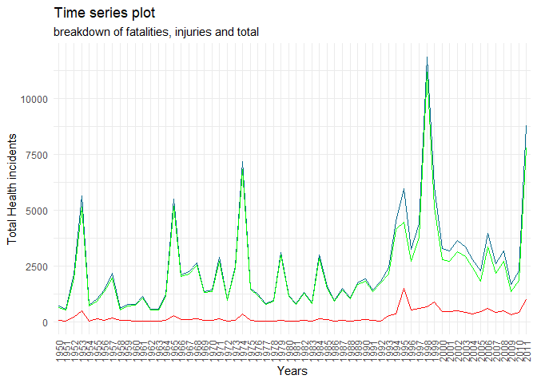

## Previus configs


  * Done

## Synopsis

Climate is an important part of our lives and world so we better try to understand the most of it to know how it affect us. 
Here I present an analysis of the principal events recorded from 1950 to 2011 and the question we want to address are:

1.	Across the United States, which types of events (as indicated in the EVTYPE are most harmful with respect to population health?
2.	Across the United States, which types of events have the greatest economic consequences?

To answer this, we are provided of a data set from the Storm data events recorded by NOAA. 
First, we adjust the data to fit our purpose, this includes data transformations and calculations based on multiple resources and investigation. 
As this a critical part of our analysis this report is covered mostly of the adjustments and a brief review of the data and how it was transformed.

Finally, my results are presented as a quick view of the top events for each question. 

For further information and doubts regarding this report please contact me.

 

## Getting data

```r
final_file = "data.csv.bz2"
url = "https://d396qusza40orc.cloudfront.net/repdata%2Fdata%2FStormData.csv.bz2"
if(!file.exists(final_file)){
  download.file(url,final_file,quiet = FALSE,method = "curl")
}else{ 
  print(paste("File ",final_file,"already exists. Skipping download.",collapse = ""))
}
```

```
## [1] "File  data.csv.bz2 already exists. Skipping download."
```
## Understanding data in file
 - Showing 10 instead of 1000 original lines loaded to keep more clean the output / report


```r
file_raw <- readLines(con<-file(final_file),n=1000)
close(con)
head(file_raw,10)
```

```
##  [1] "\"STATE__\",\"BGN_DATE\",\"BGN_TIME\",\"TIME_ZONE\",\"COUNTY\",\"COUNTYNAME\",\"STATE\",\"EVTYPE\",\"BGN_RANGE\",\"BGN_AZI\",\"BGN_LOCATI\",\"END_DATE\",\"END_TIME\",\"COUNTY_END\",\"COUNTYENDN\",\"END_RANGE\",\"END_AZI\",\"END_LOCATI\",\"LENGTH\",\"WIDTH\",\"F\",\"MAG\",\"FATALITIES\",\"INJURIES\",\"PROPDMG\",\"PROPDMGEXP\",\"CROPDMG\",\"CROPDMGEXP\",\"WFO\",\"STATEOFFIC\",\"ZONENAMES\",\"LATITUDE\",\"LONGITUDE\",\"LATITUDE_E\",\"LONGITUDE_\",\"REMARKS\",\"REFNUM\""
##  [2] "1.00,4/18/1950 0:00:00,\"0130\",\"CST\",97.00,\"MOBILE\",\"AL\",\"TORNADO\",0.00,,,,,0.00,,0.00,,,14.00,100.00,\"3\",0.00,0.00,15.00,25.00,\"K\",0.00,,,,,3040.00,8812.00,3051.00,8806.00,,1.00"                                                                                                                                                                                                                                                                                       
##  [3] "1.00,4/18/1950 0:00:00,\"0145\",\"CST\",3.00,\"BALDWIN\",\"AL\",\"TORNADO\",0.00,,,,,0.00,,0.00,,,2.00,150.00,\"2\",0.00,0.00,0.00,2.50,\"K\",0.00,,,,,3042.00,8755.00,0.00,0.00,,2.00"                                                                                                                                                                                                                                                                                                
##  [4] "1.00,2/20/1951 0:00:00,\"1600\",\"CST\",57.00,\"FAYETTE\",\"AL\",\"TORNADO\",0.00,,,,,0.00,,0.00,,,0.10,123.00,\"2\",0.00,0.00,2.00,25.00,\"K\",0.00,,,,,3340.00,8742.00,0.00,0.00,,3.00"                                                                                                                                                                                                                                                                                              
##  [5] "1.00,6/8/1951 0:00:00,\"0900\",\"CST\",89.00,\"MADISON\",\"AL\",\"TORNADO\",0.00,,,,,0.00,,0.00,,,0.00,100.00,\"2\",0.00,0.00,2.00,2.50,\"K\",0.00,,,,,3458.00,8626.00,0.00,0.00,,4.00"                                                                                                                                                                                                                                                                                                
##  [6] "1.00,11/15/1951 0:00:00,\"1500\",\"CST\",43.00,\"CULLMAN\",\"AL\",\"TORNADO\",0.00,,,,,0.00,,0.00,,,0.00,150.00,\"2\",0.00,0.00,2.00,2.50,\"K\",0.00,,,,,3412.00,8642.00,0.00,0.00,,5.00"                                                                                                                                                                                                                                                                                              
##  [7] "1.00,11/15/1951 0:00:00,\"2000\",\"CST\",77.00,\"LAUDERDALE\",\"AL\",\"TORNADO\",0.00,,,,,0.00,,0.00,,,1.50,177.00,\"2\",0.00,0.00,6.00,2.50,\"K\",0.00,,,,,3450.00,8748.00,0.00,0.00,,6.00"                                                                                                                                                                                                                                                                                           
##  [8] "1.00,11/16/1951 0:00:00,\"0100\",\"CST\",9.00,\"BLOUNT\",\"AL\",\"TORNADO\",0.00,,,,,0.00,,0.00,,,1.50,33.00,\"2\",0.00,0.00,1.00,2.50,\"K\",0.00,,,,,3405.00,8631.00,0.00,0.00,,7.00"                                                                                                                                                                                                                                                                                                 
##  [9] "1.00,1/22/1952 0:00:00,\"0900\",\"CST\",123.00,\"TALLAPOOSA\",\"AL\",\"TORNADO\",0.00,,,,,0.00,,0.00,,,0.00,33.00,\"1\",0.00,0.00,0.00,2.50,\"K\",0.00,,,,,3255.00,8558.00,0.00,0.00,,8.00"                                                                                                                                                                                                                                                                                            
## [10] "1.00,2/13/1952 0:00:00,\"2000\",\"CST\",125.00,\"TUSCALOOSA\",\"AL\",\"TORNADO\",0.00,,,,,0.00,,0.00,,,3.30,100.00,\"3\",0.00,1.00,14.00,25.00,\"K\",0.00,,,,,3334.00,8740.00,3336.00,8738.00,,9.00"
```

This brief of file shows us that there is a comma separated file with headers, double quote as columns strings enclosure. 
Most of the data is numeric, at first sight 5 colulmns are posible string factors , it seems that null values are empty string, dates have date format 4/18/1950 and have a part of time in 0, time is in a INT format in 24 hrs format (1600)

## Loading and Processing the data


```r
data_pp_1 <- read.table(file = final_file,sep = ",",header = TRUE,quote = "\"",na.strings = c("","NA"))
```

Loading seems correct now, a litte metrics in general about the dataset


```r
summary(data_pp_1)
```

```
##     STATE__       BGN_DATE           BGN_TIME          TIME_ZONE        
##  Min.   : 1.0   Length:902297      Length:902297      Length:902297     
##  1st Qu.:19.0   Class :character   Class :character   Class :character  
##  Median :30.0   Mode  :character   Mode  :character   Mode  :character  
##  Mean   :31.2                                                           
##  3rd Qu.:45.0                                                           
##  Max.   :95.0                                                           
##                                                                         
##      COUNTY       COUNTYNAME           STATE              EVTYPE         
##  Min.   :  0.0   Length:902297      Length:902297      Length:902297     
##  1st Qu.: 31.0   Class :character   Class :character   Class :character  
##  Median : 75.0   Mode  :character   Mode  :character   Mode  :character  
##  Mean   :100.6                                                           
##  3rd Qu.:131.0                                                           
##  Max.   :873.0                                                           
##                                                                          
##    BGN_RANGE          BGN_AZI           BGN_LOCATI          END_DATE        
##  Min.   :   0.000   Length:902297      Length:902297      Length:902297     
##  1st Qu.:   0.000   Class :character   Class :character   Class :character  
##  Median :   0.000   Mode  :character   Mode  :character   Mode  :character  
##  Mean   :   1.484                                                           
##  3rd Qu.:   1.000                                                           
##  Max.   :3749.000                                                           
##                                                                             
##    END_TIME           COUNTY_END COUNTYENDN       END_RANGE       
##  Length:902297      Min.   :0    Mode:logical   Min.   :  0.0000  
##  Class :character   1st Qu.:0    NA's:902297    1st Qu.:  0.0000  
##  Mode  :character   Median :0                   Median :  0.0000  
##                     Mean   :0                   Mean   :  0.9862  
##                     3rd Qu.:0                   3rd Qu.:  0.0000  
##                     Max.   :0                   Max.   :925.0000  
##                                                                   
##    END_AZI           END_LOCATI            LENGTH              WIDTH         
##  Length:902297      Length:902297      Min.   :   0.0000   Min.   :   0.000  
##  Class :character   Class :character   1st Qu.:   0.0000   1st Qu.:   0.000  
##  Mode  :character   Mode  :character   Median :   0.0000   Median :   0.000  
##                                        Mean   :   0.2301   Mean   :   7.503  
##                                        3rd Qu.:   0.0000   3rd Qu.:   0.000  
##                                        Max.   :2315.0000   Max.   :4400.000  
##                                                                              
##        F               MAG            FATALITIES          INJURIES        
##  Min.   :0.0      Min.   :    0.0   Min.   :  0.0000   Min.   :   0.0000  
##  1st Qu.:0.0      1st Qu.:    0.0   1st Qu.:  0.0000   1st Qu.:   0.0000  
##  Median :1.0      Median :   50.0   Median :  0.0000   Median :   0.0000  
##  Mean   :0.9      Mean   :   46.9   Mean   :  0.0168   Mean   :   0.1557  
##  3rd Qu.:1.0      3rd Qu.:   75.0   3rd Qu.:  0.0000   3rd Qu.:   0.0000  
##  Max.   :5.0      Max.   :22000.0   Max.   :583.0000   Max.   :1700.0000  
##  NA's   :843563                                                           
##     PROPDMG         PROPDMGEXP           CROPDMG         CROPDMGEXP       
##  Min.   :   0.00   Length:902297      Min.   :  0.000   Length:902297     
##  1st Qu.:   0.00   Class :character   1st Qu.:  0.000   Class :character  
##  Median :   0.00   Mode  :character   Median :  0.000   Mode  :character  
##  Mean   :  12.06                      Mean   :  1.527                     
##  3rd Qu.:   0.50                      3rd Qu.:  0.000                     
##  Max.   :5000.00                      Max.   :990.000                     
##                                                                           
##      WFO             STATEOFFIC         ZONENAMES            LATITUDE   
##  Length:902297      Length:902297      Length:902297      Min.   :   0  
##  Class :character   Class :character   Class :character   1st Qu.:2802  
##  Mode  :character   Mode  :character   Mode  :character   Median :3540  
##                                                           Mean   :2875  
##                                                           3rd Qu.:4019  
##                                                           Max.   :9706  
##                                                           NA's   :47    
##    LONGITUDE        LATITUDE_E     LONGITUDE_       REMARKS         
##  Min.   :-14451   Min.   :   0   Min.   :-14455   Length:902297     
##  1st Qu.:  7247   1st Qu.:   0   1st Qu.:     0   Class :character  
##  Median :  8707   Median :   0   Median :     0   Mode  :character  
##  Mean   :  6940   Mean   :1452   Mean   :  3509                     
##  3rd Qu.:  9605   3rd Qu.:3549   3rd Qu.:  8735                     
##  Max.   : 17124   Max.   :9706   Max.   :106220                     
##                   NA's   :40                                        
##      REFNUM      
##  Min.   :     1  
##  1st Qu.:225575  
##  Median :451149  
##  Mean   :451149  
##  3rd Qu.:676723  
##  Max.   :902297  
## 
```

 + First values
 

```r
head(data_pp_1,10)
```

```
##    STATE__           BGN_DATE BGN_TIME TIME_ZONE COUNTY COUNTYNAME STATE
## 1        1  4/18/1950 0:00:00     0130       CST     97     MOBILE    AL
## 2        1  4/18/1950 0:00:00     0145       CST      3    BALDWIN    AL
## 3        1  2/20/1951 0:00:00     1600       CST     57    FAYETTE    AL
## 4        1   6/8/1951 0:00:00     0900       CST     89    MADISON    AL
## 5        1 11/15/1951 0:00:00     1500       CST     43    CULLMAN    AL
## 6        1 11/15/1951 0:00:00     2000       CST     77 LAUDERDALE    AL
## 7        1 11/16/1951 0:00:00     0100       CST      9     BLOUNT    AL
## 8        1  1/22/1952 0:00:00     0900       CST    123 TALLAPOOSA    AL
## 9        1  2/13/1952 0:00:00     2000       CST    125 TUSCALOOSA    AL
## 10       1  2/13/1952 0:00:00     2000       CST     57    FAYETTE    AL
##     EVTYPE BGN_RANGE BGN_AZI BGN_LOCATI END_DATE END_TIME COUNTY_END COUNTYENDN
## 1  TORNADO         0    <NA>       <NA>     <NA>     <NA>          0         NA
## 2  TORNADO         0    <NA>       <NA>     <NA>     <NA>          0         NA
## 3  TORNADO         0    <NA>       <NA>     <NA>     <NA>          0         NA
## 4  TORNADO         0    <NA>       <NA>     <NA>     <NA>          0         NA
## 5  TORNADO         0    <NA>       <NA>     <NA>     <NA>          0         NA
## 6  TORNADO         0    <NA>       <NA>     <NA>     <NA>          0         NA
## 7  TORNADO         0    <NA>       <NA>     <NA>     <NA>          0         NA
## 8  TORNADO         0    <NA>       <NA>     <NA>     <NA>          0         NA
## 9  TORNADO         0    <NA>       <NA>     <NA>     <NA>          0         NA
## 10 TORNADO         0    <NA>       <NA>     <NA>     <NA>          0         NA
##    END_RANGE END_AZI END_LOCATI LENGTH WIDTH F MAG FATALITIES INJURIES PROPDMG
## 1          0    <NA>       <NA>   14.0   100 3   0          0       15    25.0
## 2          0    <NA>       <NA>    2.0   150 2   0          0        0     2.5
## 3          0    <NA>       <NA>    0.1   123 2   0          0        2    25.0
## 4          0    <NA>       <NA>    0.0   100 2   0          0        2     2.5
## 5          0    <NA>       <NA>    0.0   150 2   0          0        2     2.5
## 6          0    <NA>       <NA>    1.5   177 2   0          0        6     2.5
## 7          0    <NA>       <NA>    1.5    33 2   0          0        1     2.5
## 8          0    <NA>       <NA>    0.0    33 1   0          0        0     2.5
## 9          0    <NA>       <NA>    3.3   100 3   0          1       14    25.0
## 10         0    <NA>       <NA>    2.3   100 3   0          0        0    25.0
##    PROPDMGEXP CROPDMG CROPDMGEXP  WFO STATEOFFIC ZONENAMES LATITUDE LONGITUDE
## 1           K       0       <NA> <NA>       <NA>      <NA>     3040      8812
## 2           K       0       <NA> <NA>       <NA>      <NA>     3042      8755
## 3           K       0       <NA> <NA>       <NA>      <NA>     3340      8742
## 4           K       0       <NA> <NA>       <NA>      <NA>     3458      8626
## 5           K       0       <NA> <NA>       <NA>      <NA>     3412      8642
## 6           K       0       <NA> <NA>       <NA>      <NA>     3450      8748
## 7           K       0       <NA> <NA>       <NA>      <NA>     3405      8631
## 8           K       0       <NA> <NA>       <NA>      <NA>     3255      8558
## 9           K       0       <NA> <NA>       <NA>      <NA>     3334      8740
## 10          K       0       <NA> <NA>       <NA>      <NA>     3336      8738
##    LATITUDE_E LONGITUDE_ REMARKS REFNUM
## 1        3051       8806    <NA>      1
## 2           0          0    <NA>      2
## 3           0          0    <NA>      3
## 4           0          0    <NA>      4
## 5           0          0    <NA>      5
## 6           0          0    <NA>      6
## 7           0          0    <NA>      7
## 8           0          0    <NA>      8
## 9        3336       8738    <NA>      9
## 10       3337       8737    <NA>     10
```

  + Last Values


```r
tail(data_pp_1,10)
```

```
##        STATE__           BGN_DATE    BGN_TIME TIME_ZONE COUNTY
## 902288       8  11/5/2011 0:00:00 03:00:00 AM       MST     17
## 902289      48 11/28/2011 0:00:00 03:30:00 AM       CST    250
## 902290       8 11/12/2011 0:00:00 09:00:00 PM       MST     73
## 902291      28 11/28/2011 0:00:00 03:00:00 PM       CST      3
## 902292      47 11/28/2011 0:00:00 03:00:00 PM       CST     21
## 902293      56 11/30/2011 0:00:00 10:30:00 PM       MST      7
## 902294      30 11/10/2011 0:00:00 02:48:00 PM       MST      9
## 902295       2  11/8/2011 0:00:00 02:58:00 PM       AKS    213
## 902296       2  11/9/2011 0:00:00 10:21:00 AM       AKS    202
## 902297       1 11/28/2011 0:00:00 08:00:00 PM       CST      6
##                                  COUNTYNAME STATE         EVTYPE BGN_RANGE
## 902288                         COZ012 - 017    CO WINTER WEATHER         0
## 902289                         TXZ248 - 250    TX   FROST/FREEZE         0
## 902290             COZ062 - 073 - 075 - 087    CO      HIGH WIND         0
## 902291                         MSZ001 - 003    MS WINTER WEATHER         0
## 902292 TNZ001>004 - 019>021 - 048>055 - 088    TN WINTER WEATHER         0
## 902293                         WYZ007 - 017    WY      HIGH WIND         0
## 902294                         MTZ009 - 010    MT      HIGH WIND         0
## 902295                               AKZ213    AK      HIGH WIND         0
## 902296                               AKZ202    AK       BLIZZARD         0
## 902297                               ALZ006    AL     HEAVY SNOW         0
##        BGN_AZI BGN_LOCATI           END_DATE    END_TIME COUNTY_END COUNTYENDN
## 902288    <NA>       <NA>  11/6/2011 0:00:00 06:00:00 AM          0         NA
## 902289    <NA>       <NA> 11/28/2011 0:00:00 08:00:00 AM          0         NA
## 902290    <NA>       <NA> 11/13/2011 0:00:00 08:00:00 AM          0         NA
## 902291    <NA>       <NA> 11/29/2011 0:00:00 12:00:00 PM          0         NA
## 902292    <NA>       <NA> 11/29/2011 0:00:00 12:00:00 PM          0         NA
## 902293    <NA>       <NA> 11/30/2011 0:00:00 10:30:00 PM          0         NA
## 902294    <NA>       <NA> 11/10/2011 0:00:00 02:48:00 PM          0         NA
## 902295    <NA>       <NA>  11/9/2011 0:00:00 01:15:00 PM          0         NA
## 902296    <NA>       <NA>  11/9/2011 0:00:00 05:00:00 PM          0         NA
## 902297    <NA>       <NA> 11/29/2011 0:00:00 04:00:00 AM          0         NA
##        END_RANGE END_AZI END_LOCATI LENGTH WIDTH  F MAG FATALITIES INJURIES
## 902288         0    <NA>       <NA>      0     0 NA   0          0        0
## 902289         0    <NA>       <NA>      0     0 NA   0          0        0
## 902290         0    <NA>       <NA>      0     0 NA  65          0        0
## 902291         0    <NA>       <NA>      0     0 NA   0          0        0
## 902292         0    <NA>       <NA>      0     0 NA   0          0        0
## 902293         0    <NA>       <NA>      0     0 NA  66          0        0
## 902294         0    <NA>       <NA>      0     0 NA  52          0        0
## 902295         0    <NA>       <NA>      0     0 NA  81          0        0
## 902296         0    <NA>       <NA>      0     0 NA   0          0        0
## 902297         0    <NA>       <NA>      0     0 NA   0          0        0
##        PROPDMG PROPDMGEXP CROPDMG CROPDMGEXP WFO
## 902288       0          K       0          K GJT
## 902289       0          K       0          K BRO
## 902290       0          K       0          K PUB
## 902291       0          K       0          K MEG
## 902292       0          K       0          K MEG
## 902293       0          K       0          K RIW
## 902294       0          K       0          K TFX
## 902295       0          K       0          K AFG
## 902296       0          K       0          K AFG
## 902297       0          K       0          K HUN
##                                   STATEOFFIC
## 902288                        COLORADO, West
## 902289                          TEXAS, South
## 902290 COLORADO, South Central and Southeast
## 902291                    MISSISSIPPI, North
## 902292                       TENNESSEE, West
## 902293             WYOMING, Central and West
## 902294                      MONTANA, Central
## 902295                      ALASKA, Northern
## 902296                      ALASKA, Northern
## 902297                        ALABAMA, North
##                                                                                                                                                                 ZONENAMES
## 902288                                                                   WEST ELK AND SAWATCH MOUNTAINS - WEST ELK AND SAWATCH MOUNTAINS - UNCOMPAHGRE PLATEAU AND DALLAS
## 902289                                                                                                                                           ZAPATA - ZAPATA - BROOKS
## 902290 CENTRAL CHAFFEE COUNTY BELOW 9 - CENTRAL CHAFFEE COUNTY BELOW 9 - NORTHERN SANGRE DE CRISTO MOUN - SOUTHERN SANGRE DE CRISTO MOUN - WALSENBURG VICINITY / UPPER HU
## 902291                                                                                                                                         DE SOTO - DE SOTO - BENTON
## 902292      LAKE - LAKE - OBION - WEAKLEY - HENRY - DYER - GIBSON - CARROLL - LAUDERDALE - TIPTON - HAYWOOD - CROCKETT - MADISON - CHESTER - HENDERSON - DECATUR - SHELBY
## 902293                                                                                   OWL CREEK & BRIDGER MOUNTAINS - OWL CREEK & BRIDGER MOUNTAINS - WIND RIVER BASIN
## 902294                                                                                          NORTH ROCKY MOUNTAIN FRONT - NORTH ROCKY MOUNTAIN FRONT - EASTERN GLACIER
## 902295                                                                                                      ST LAWRENCE IS. BERING STRAIT - ST LAWRENCE IS. BERING STRAIT
## 902296                                                                                                                      NORTHERN ARCTIC COAST - NORTHERN ARCTIC COAST
## 902297                                                                                                                                                  MADISON - MADISON
##        LATITUDE LONGITUDE LATITUDE_E LONGITUDE_
## 902288        0         0          0          0
## 902289        0         0          0          0
## 902290        0         0          0          0
## 902291        0         0          0          0
## 902292        0         0          0          0
## 902293        0         0          0          0
## 902294        0         0          0          0
## 902295        0         0          0          0
## 902296        0         0          0          0
## 902297        0         0          0          0
##                                                                                                                                                                                                                                                                                                                                                                                                                                                                                                                                                                                                                                                                                                                                                                                                                                                                                                                                                                                                                                                                                                                                                                                                                                                                                                                                                                                                                                                                                                                                                                                                                                                                                                                                                                                                                                                                                                                                                                                                                                                                                                        REMARKS
## 902288                                                                                                                                                                                                                                                                                                                                                                                                                                                                                                                                                                                                                                                                                                                                                                                                                                                                                                                                                                                                                                                                                                                                                                                                                                                                                                                                                                                                                                                                                                                                                                                                                                                                                                                                                                                           EPISODE NARRATIVE: A strong Pacific trough produced significant to heavy snowfall in the mountains and some lower elevation areas of western Colorado.EVENT NARRATIVE: Snowfall ranged from 5 to 12 inches above the 8000 foot level. Wind gusts of 25 to 45 mph produced areas of blowing and drifting snow.
## 902289                                                                                                                                                                                                                                                                                                                                                                                                                                                                                                                                                                                                          EPISODE NARRATIVE: A true blue norther drove pure Canadian high pressure directly into South Texas and northern Mexico, beginning on November 27th and continuing through early on the 29th before the high drifted into the southeast U.S.  Extremely dry and relatively chilly air invaded Deep South Texas and the Rio Grande Valley; temperatures bottomed out in the mid 20s to lower 30s for all but the southeast corner of the Rio Grande Valley on the 28th.\n\nThe event was a rare dry freeze, as humidity through the coldest periods remained below 50 percent.  Ambient temperatures varied greatly depending on the height of the sensor taking the measurements.  At eye level, temperatures fell to or just below freezing in many areas, but remained a few degrees above freezing in others.  Just above the ground, and in wind protected hollows, temperatures fell into the 20s; local hard freezes, defined as 2 or more hours with temperatures below 28 degrees, likely occurred.  Agricultural damage was not known as of this writing.EVENT NARRATIVE: Temperatures fell below freezing in wind protected areas, including Falfurrias, between 3 and 4 AM and continued until 8 AM on the 28th.  Minimum temperature at the Hollywood Hunting Camp, 3.5 miles west of Falfurrias, dipped to 26 degrees between 7 and 8 AM.  Temperatures in non wind protected areas only fell into the mid 30s, including Brooks County Airport (2 miles southeast of Falfurrias).
## 902290                                                                                                                                                                                                                                                                                                                                                                                                                                                                                                                               EPISODE NARRATIVE: A strong storm system centered over northern Colorado produced widespread damaging winds...in excess of 100 mph at times...over south central and southeast Colorado.  There were widespread power outages and damage...especially over sections of Custer and Las Animas Counties.  Custer County was under a state of emergency for a time.  Numerous trees and power lines were blown down.  In addition...sheds and barns were destroyed...a few cars were damaged or destroyed when large tree limbs came crashing down on them...a few homes also had tree damage...trailers were knocked over and some roofs were damaged and/or blown off.  Higher reported wind gusts include 59 mph at the Pueblo Memorial Airport...60 mph near Walsenburg (Huerfano County)...61 mph near Falcon (northern El Paso County)...65 mph at Canon City (Fremont County)...67 mph around Florence (Fremont County)...69 mph near Wetmore (Pueblo County)...70 mph near Silver Cliff and Westcliffe (Custer County)...71 mph near Colorado City (Pueblo County)...76 mph  south of the Royal Gorge (Fremont County)...86 mph south of the Air Force Academy (El Paso County)...89 mph near La Veta (Huerfano County)...90 mph west of Westcliffe (Custer County) and near Stonewall (Las Animas County)...91 mph southwest of Buena Vista (Chaffee County)...92 mph southwest of Swissvale in the Sangre de Cristo Mountains (Fremont County), and finally 109 mph at the summit of Pikes Peak.  A rough estimate of damage was around $750,000.EVENT NARRATIVE: 
## 902291                                                                                                                                                                                                                                                                                                                                                                                                                                                                                                                                                                                                                                                                                                                                                                                                                                                                                                                                                                                                                                                                                                                                                                                                                                                                                                                                                                                                                                                                                                                                                                                                                                                                                            EPISODE NARRATIVE: A powerful upper level low pressure system brought snow to portions of Northeast Arkansas, the Missouri Bootheel, West Tennessee and extreme north Mississippi. Most areas picked up between 1 and 3 inches of with areas of Northeast Arkansas and the Missouri Bootheel receiving between 4 and 6 inches of snow.EVENT NARRATIVE: Between 1 and 2 inches of snow fell in Benton County.
## 902292                                                                                                                                                                                                                                                                                                                                                                                                                                                                                                                                                                                                                                                                                                                                                                                                                                                                                                                                                                                                                                                                                                                                                                                                                                                                                                                                                                                                                                                                                                                                                                                                                                                                                                    EPISODE NARRATIVE: A powerful upper level low pressure system brought snow to portions of Northeast Arkansas, the Missouri Bootheel, West Tennessee and extreme north Mississippi. Most areas picked up between 1 and 3 inches of with areas of Northeast Arkansas and the Missouri Bootheel receiving between 4 and 6 inches of snow.EVENT NARRATIVE: Around 1 inch of snow fell in Carroll County.
## 902293                                                                                                                                                                                                                                                                                                                                                                                                                                                                                                                                                                                                                                                                                                                                                                                                                                                                                                                                                                                                                                                                                                                                                                                                                                                                                                                                                                                                                                                                                                                                                                                                                                                                                                                                                                                                                                           EPISODE NARRATIVE: A strong cold front moved south through north central Wyoming bringing high wind to the Meeteetse area and along the south slopes of the western Owl Creek Range. Wind gusts to 76 mph were recorded at Madden Reservoir.EVENT NARRATIVE: 
## 902294                                                                                                                                                                                                                                                                                                                                                                                                                                                                                                                                                                                                                                                                                                                                                                                                                                                                                                                                                                                                                                                                                                                                                                                                                                                                                                                                                                                                                                                                                                                                                                                                                                                                                                                                                                                      EPISODE NARRATIVE: A strong westerly flow aloft produced gusty winds at the surface along the Rocky Mountain front and over the plains of Central Montana. Wind gusts in excess of 60 mph were reported.EVENT NARRATIVE: A wind gust to 60 mph was reported at East Glacier Park 1ENE (the Two Medicine DOT site).
## 902295 EPISODE NARRATIVE: A 960 mb low over the southern Aleutians at 0300AKST on the 8th intensified to 945 mb near the Gulf of Anadyr by 2100AKST on the 8th. The low crossed the Chukotsk Peninsula as a 956 mb low at 0900AKST on the 9th, and moved into the southern Chukchi Sea as a 958 mb low by 2100AKST on the 9th. The low then tracked to the northwest and weakened to 975 mb about 150 miles north of Wrangel Island by 1500AKST on the 10th. The storm was one of the strongest storms to impact the west coast of Alaska since November 1974. \n\nZone 201: Blizzard conditions were observed at Wainwright from approximately 1153AKST through 1611AKST on the 9th. The visibility was frequently reduced to one quarter mile in snow and blowing snow. There was a peak wind gust to 43kt (50 mph) at the Wainwright ASOS. During this event, there was also a peak wind gust to \n68 kt (78 mph) at the Cape Lisburne AWOS. \n\nZone 202: Blizzard conditions were observed at Barrow from approximately 1021AKST through 1700AKST on the 9th. The visibility was frequently reduced to one quarter mile or less in blowing snow. There was a peak wind gust to 46 kt (53 mph) at the Barrow ASOS. \n\nZone 207: Blizzard conditions were observed at Kivalina from approximately 0400AKST through 1230AKST on the 9th. The visibility was frequently reduced to one quarter of a mile in snow and blowing snow. There was a peak wind gust to 61 kt (70 mph) at the Kivalina ASOS.  The doors to the village transportation shed were blown out to sea.  Many homes lost portions of their tin roofing, and satellite dishes were ripped off of roofs. One home had its door blown off.  At Point Hope, severe blizzard conditions were observed. There was a peak wind gust of 68 kt (78 mph) at the Point Hope AWOS before power was lost to the AWOS. It was estimated that the wind gusted as high as 85 mph in the village during the height of the storm during the morning and early afternoon hours on the 9th. Five power poles were knocked down in the storm EVENT NARRATIVE: 
## 902296 EPISODE NARRATIVE: A 960 mb low over the southern Aleutians at 0300AKST on the 8th intensified to 945 mb near the Gulf of Anadyr by 2100AKST on the 8th. The low crossed the Chukotsk Peninsula as a 956 mb low at 0900AKST on the 9th, and moved into the southern Chukchi Sea as a 958 mb low by 2100AKST on the 9th. The low then tracked to the northwest and weakened to 975 mb about 150 miles north of Wrangel Island by 1500AKST on the 10th. The storm was one of the strongest storms to impact the west coast of Alaska since November 1974. \n\nZone 201: Blizzard conditions were observed at Wainwright from approximately 1153AKST through 1611AKST on the 9th. The visibility was frequently reduced to one quarter mile in snow and blowing snow. There was a peak wind gust to 43kt (50 mph) at the Wainwright ASOS. During this event, there was also a peak wind gust to \n68 kt (78 mph) at the Cape Lisburne AWOS. \n\nZone 202: Blizzard conditions were observed at Barrow from approximately 1021AKST through 1700AKST on the 9th. The visibility was frequently reduced to one quarter mile or less in blowing snow. There was a peak wind gust to 46 kt (53 mph) at the Barrow ASOS. \n\nZone 207: Blizzard conditions were observed at Kivalina from approximately 0400AKST through 1230AKST on the 9th. The visibility was frequently reduced to one quarter of a mile in snow and blowing snow. There was a peak wind gust to 61 kt (70 mph) at the Kivalina ASOS.  The doors to the village transportation shed were blown out to sea.  Many homes lost portions of their tin roofing, and satellite dishes were ripped off of roofs. One home had its door blown off.  At Point Hope, severe blizzard conditions were observed. There was a peak wind gust of 68 kt (78 mph) at the Point Hope AWOS before power was lost to the AWOS. It was estimated that the wind gusted as high as 85 mph in the village during the height of the storm during the morning and early afternoon hours on the 9th. Five power poles were knocked down in the storm EVENT NARRATIVE: 
## 902297                           EPISODE NARRATIVE: An intense upper level low developed on the 28th at the base of a highly amplified upper trough across the Great Lakes and Mississippi Valley.  The upper low closed off over the mid South and tracked northeast across the Tennessee Valley during the morning of the 29th.   A warm conveyor belt of heavy rainfall developed in advance of the low which dumped from around 2 to over 5 inches of rain across the eastern two thirds of north Alabama and middle Tennessee.  The highest rain amounts were recorded in Jackson and DeKalb Counties with 3 to 5 inches.  The rain fell over 24 to 36 hour period, with rainfall remaining light to moderate during most its duration.  The rainfall resulted in minor river flooding along the Little River, Big Wills Creek and Paint Rock.   A landslide occurred on Highway 35 just north of Section in Jackson County.  A driver was trapped in his vehicle, but was rescued unharmed.  Trees, boulders and debris blocked 100 to 250 yards of Highway 35.\n\nThe rain mixed with and changed to snow across north Alabama during the afternoon and  evening hours of the 28th, and lasted into the 29th.  The heaviest bursts of snow occurred in northwest Alabama during the afternoon and evening hours, and in north central and northeast Alabama during the overnight and morning hours.  Since ground temperatures were in the 50s, and air temperatures in valley areas only dropped into the mid 30s, most of the snowfall melted on impact with mostly trace amounts reported in valley locations.  However, above 1500 foot elevation, snow accumulations of 1 to 2 inches were reported.  The heaviest amount was 2.3 inches on Monte Sano Mountain, about 5 miles northeast of Huntsville.EVENT NARRATIVE: Snowfall accumulations of up to 2.3 inches were reported on the higher elevations of eastern Madison County.  A snow accumulation of 1.5 inches was reported 2.7 miles south of Gurley, while 2.3 inches was reported 3 miles east of Huntsville atop Monte Sano Mountain.
##        REFNUM
## 902288 902288
## 902289 902289
## 902290 902290
## 902291 902291
## 902292 902292
## 902293 902293
## 902294 902294
## 902295 902295
## 902296 902296
## 902297 902297
```


Observations:  
  - Total Number of rows is **902297**, **37** variables  
  - *F* column is almost empty on all the data.set  
  - *COUNTYENDN* is always NA  
  - *COUNTY_END* is always 0  
  - *Length*, *Width* are 0 at least at the 3rd quantile  
  - *BGN_TIME* has mixed values, integers and time strings  

* Using a different data.frame to keep the original for further checks


```r
data_pp_2<-data.frame()
data_pp_2<-data_pp_1
```

* Changing data types of dates: BGN_DATE,END_DATE, this for further manipulation and plot of the health damage by year


```r
data_pp_2$BGN_DATE <- as.Date(data_pp_2$BGN_DATE,format="%m/%d/%Y %H:%M:%S")
data_pp_2$END_DATE <- as.Date(data_pp_2$END_DATE,format="%m/%d/%Y %H:%M:%S")
summary(data_pp_2[,c("BGN_DATE","END_DATE")])
```

```
##     BGN_DATE             END_DATE         
##  Min.   :1950-01-03   Min.   :1986-04-10  
##  1st Qu.:1995-04-20   1st Qu.:2000-09-01  
##  Median :2002-03-18   Median :2005-04-30  
##  Mean   :1998-12-27   Mean   :2004-09-26  
##  3rd Qu.:2007-07-28   3rd Qu.:2008-08-10  
##  Max.   :2011-11-30   Max.   :2011-11-30  
##                       NA's   :243411
```

Further transformations are included in the Questions section

## Questions

1. Across the United States, which types of events (as indicated in the EVTYPE variable) are most harmful with respect to population health?

```

1.1 - I'm going to analyse the EVTYPE column


```r
evt <-
  data_pp_2 %>%
  group_by(EVTYPE) %>%
  summarize(total = n())
#evt
head(evt[order(-evt$total),],10)
```

```
## # A tibble: 10 x 2
##    EVTYPE              total
##    <chr>               <int>
##  1 HAIL               288661
##  2 TSTM WIND          219940
##  3 THUNDERSTORM WIND   82563
##  4 TORNADO             60652
##  5 FLASH FLOOD         54277
##  6 FLOOD               25326
##  7 THUNDERSTORM WINDS  20843
##  8 HIGH WIND           20212
##  9 LIGHTNING           15754
## 10 HEAVY SNOW          15708
```

Because there are 2 different events, I decided that we could use some help (1). Getting a cleaner catalog of events, therefore we are going to match this by string distance. 

First some cleaning and data wrangling


```r
event_type_catalog <- read.csv2(file = "EVTYPE.csv",header = TRUE)
evt$leandata <- evt$EVTYPE
evt$leandata <- as.character(evt$leandata)
evt$leandata <- trimws(evt$leandata)
evt$leandata <- tolower(evt$leandata)
event_type_catalog$EVTYPE <- as.character(event_type_catalog$EVTYPE)
event_type_catalog$EVTYPE <- trimws(event_type_catalog$EVTYPE)
event_type_catalog$EVTYPE <- tolower(event_type_catalog$EVTYPE)
```

Quick look of the data.frames


```r
head(evt,10)
```

```
## # A tibble: 10 x 3
##    EVTYPE                  total leandata          
##    <chr>                   <int> <chr>             
##  1 "   HIGH SURF ADVISORY"     1 high surf advisory
##  2 " COASTAL FLOOD"            1 coastal flood     
##  3 " FLASH FLOOD"              1 flash flood       
##  4 " LIGHTNING"                1 lightning         
##  5 " TSTM WIND"                4 tstm wind         
##  6 " TSTM WIND (G45)"          1 tstm wind (g45)   
##  7 " WATERSPOUT"               1 waterspout        
##  8 " WIND"                     1 wind              
##  9 "?"                         1 ?                 
## 10 "ABNORMAL WARMTH"           4 abnormal warmth
```

```r
head(event_type_catalog,10)
```

```
##                   EVTYPE
## 1  astronomical low tide
## 2              avalanche
## 3               blizzard
## 4          coastal flood
## 5        cold/wind chill
## 6            debris flow
## 7              dense fog
## 8            dense smoke
## 9                drought
## 10            dust devil
```
How many rows by event type the original data.frame has, quick view


```r
evt2 <- 
  evt %>%
  group_by(leandata) %>%
  summarize(total = sum(total))

head(evt2[order(-evt2$total),],10)
```

```
## # A tibble: 10 x 2
##    leandata            total
##    <chr>               <int>
##  1 hail               288661
##  2 tstm wind          219946
##  3 thunderstorm wind   82564
##  4 tornado             60652
##  5 flash flood         54278
##  6 flood               25327
##  7 thunderstorm winds  20843
##  8 high wind           20214
##  9 lightning           15755
## 10 heavy snow          15708
```

Starting the process of getting the distances by jaro-winker method (closer to 0 is better)


```r
# Reclassification of EVTYPE to get a more accurate global classification

# Actual eventtype (dirty data)
uniquemodels <- unique(as.character(evt2$leandata))
# Catalog of NOAA to match
uniquemodels2 <- unique(as.character(event_type_catalog$EVTYPE)) 

# Calculation of the string distances by Jaro–Winkler
distancemodels <- stringdistmatrix(uniquemodels2,uniquemodels,method = "jw")

# setting colnames and rownames to identify which row and column correspond to each one distance
rownames(distancemodels) <- uniquemodels2
colnames(distancemodels) <- uniquemodels
#hc <- hclust(as.dist(distancemodels,upper = TRUE))
#plot(hc)
#rect.hclust(hc,k=20)
#list of minimun values (minimum values per column)
mins<-apply(distancemodels, 2, min)
#return list of the row number of the minimum value (most similar row vs columns)
minlist<-apply(distancemodels, 2, which.min)
#return list of matching values, minlist are the values of the NOAA catalog with is more likely to match the dirty data
matchwith<-uniquemodels2[minlist]

answer<-data.frame(uniquemodels, matchwith, mins)
maxDist<-0.30
answer_filter <- answer[(answer$mins<=maxDist)&(order(-answer$mins)),]
head(answer_filter[order(-answer_filter$mins),],10)
```

```
##                                                  uniquemodels
## snowfall record                               snowfall record
## street flooding                               street flooding
## extremely wet                                   extremely wet
## minor flooding                                 minor flooding
## extreme windchill temperatures extreme windchill temperatures
## gradient wind                                   gradient wind
## urban/street flooding                   urban/street flooding
## forest fires                                     forest fires
## ice floes                                           ice floes
## snowstorm                                           snowstorm
##                                              matchwith      mins
## snowfall record                        lakeshore flood 0.2989899
## street flooding                            flash flood 0.2989899
## extremely wet                  extreme cold/wind chill 0.2986622
## minor flooding                         lakeshore flood 0.2984127
## extreme windchill temperatures extreme cold/wind chill 0.2983897
## gradient wind                        thunderstorm wind 0.2975113
## urban/street flooding                      flash flood 0.2972583
## forest fires                              frost/freeze 0.2962963
## ice floes                                    ice storm 0.2962963
## snowstorm                                    ice storm 0.2962963
```
Getting in the **evt2** data.frame the values adjusted to the master catalog of event_types

```r
evt2_match <- merge(evt2,answer_filter,by.x=c("leandata"),by.y=c("uniquemodels"),all.x = TRUE)
head(evt2_match[order(-evt2_match$total),],10)
```

```
##               leandata  total         matchwith       mins
## 204               hail 288661              hail 0.00000000
## 771          tstm wind 219946         high wind 0.29629630
## 677  thunderstorm wind  82564 thunderstorm wind 0.00000000
## 750            tornado  60652           tornado 0.00000000
## 130        flash flood  54278       flash flood 0.00000000
## 146              flood  25327             flood 0.00000000
## 703 thunderstorm winds  20843 thunderstorm wind 0.01851852
## 312          high wind  20214         high wind 0.00000000
## 410          lightning  15755       lightning c 0.06060606
## 266         heavy snow  15708        heavy snow 0.00000000
```

Lets do a quick analysis of the percentiles in where the data is null, separate the data in null and not null


```r
evt2_match$factor_matchwith<-0
evt2_match[complete.cases(evt2_match),'factor_matchwith'] <- 1
```


```r
evt3 <- 
  evt2_match %>%
  group_by(factor_matchwith) %>%
  summarize(total = sum(total), total_cn = n())

evt3[order(-evt3$total),]
```

```
## # A tibble: 2 x 3
##   factor_matchwith  total total_cn
##              <dbl>  <int>    <int>
## 1                1 895561      548
## 2                0   6736      342
```
At a **maxDist** of .30 we found a good proportion of data events  re-classified, 0.7521542% are misspelled events, summary or something that occur one time and not relevant

A little review of the data.frames I have  
**data_pp_2** has the full data, whit a few transformations  
**evt** has the relation between original *EVTYPE* column and *leandata* (the one used to measure distances)  
**evt2_match** has the final data.frame with a more clear classification (matchwith column)


```r
x0<-merge(evt,evt2_match,by.x=c("leandata"),by.y=c("leandata"),all.x = TRUE)
x<-merge(data_pp_2,x0,by.x=c("EVTYPE"),by.y=c("EVTYPE"),all.x = TRUE) 
#matchwith is the final event_type_colum
```

1.2 Checking the rest of the columns I discovered two columns, one of fatalities and other for injuries, for practical purposes we're going to break that down by year and if it was fatal o not, a plot would by helpful here.


```r
x_p1 <-
x %>%
  group_by(matchwith) %>%
  summarize(fatal = sum(FATALITIES), non_fatal = sum(INJURIES))
x_p1$total <- x_p1$fatal + x_p1$non_fatal
x_p1 <- x_p1[order(-x_p1$total),]
```

This **plot** to see over the years how injuries evolve


```r
x_p1_1 <-
x %>%
  group_by(year=format(BGN_DATE,'%Y')) %>%
  summarize(fatal = sum(FATALITIES), non_fatal = sum(INJURIES))
x_p1_1$total <- x_p1_1$fatal + x_p1_1$non_fatal
x_p1_1 <- x_p1_1[order(x_p1_1$year),]

# using a factor for fatalities would be more practical
g<-ggplot(data=x_p1_1,aes(x=year,group = 1))
g %>%
+geom_line(aes(y=total),linetype="solid",color="deepskyblue4") %>%
+geom_line(aes(y=fatal),linetype="solid",color="red") %>%
+geom_line(aes(y=non_fatal),linetype="solid",color="green") %>%
+theme_minimal() %>%
+theme(axis.text.x = element_text(angle = 90, vjust = 0.5, hjust=1)) %>%
+labs(x = "Years",y="Total Health incidents", title = "Time series plot",subtitle = "breakdown of fatalities, injuries and total",colour= "Metric")
```

<!-- -->


Evolve of how Health Injuries evolve over time (Year)


2. Across the United States, which types of events have the greatest economic consequences?

This requires a little more of transformation, we part from the "matchwith" column which 
we have been working with. 
Checking columns in the data, this two columns show economic damage on property and crops 
("PROPDMG","CROPDMG"), so we're going to adjust with the corresponding EXP columns to get 
a comparable value ("PROPDMGEXP","CROPDMGEXP").
Rules are:

```r
x_minimal <- x[,c("matchwith","PROPDMG","PROPDMGEXP","CROPDMG","CROPDMGEXP")]
```

Existing values of exponents


```r
table(x_minimal$PROPDMGEXP)
```

```
## 
##      -      ?      +      0      1      2      3      4      5      6      7 
##      1      8      5    216     25     13      4      4     28      4      5 
##      8      B      h      H      K      m      M 
##      1     40      1      6 424665      7  11330
```

```r
table(x_minimal$CROPDMGEXP)
```

```
## 
##      ?      0      2      B      k      K      m      M 
##      7     19      1      9     21 281832      1   1994
```

mapping and equivalencies

```r
v_exp   <-c("-","?","+","0","1","2","3","4","5","6","7","8","9","B","h","H","K","k","m","M")
v_value <-c(0,0,1,10,10,10,10,10,10,10,10,10,10,1000000000,100,100,1000,1000,1000000,1000000)
v_transform <- data.frame(v_exp,v_value)
x_minimal_transform <- merge(x_minimal,v_transform,by.x = c("PROPDMGEXP"),by.y = c("v_exp"),all.x = TRUE ) 
x_minimal_transform <- merge(x_minimal_transform,v_transform,by.x = c("CROPDMGEXP"),by.y = c("v_exp"),all.x = TRUE ) 

x_minimal_transform$CROPDMG_VALUE<-x_minimal_transform$CROPDMG*x_minimal_transform$v_value.y
x_minimal_transform$PROPDMG_VALUE<-x_minimal_transform$PROPDMG*x_minimal_transform$v_value.x
x_minimal_transform$total=coalesce(x_minimal_transform$PROPDMG_VALUE,0)+coalesce(x_minimal_transform$CROPDMG_VALUE,0)
```

Creating a dataframe grouped by event_type, and ordered by the damage value 


```r
x_p2 <-
x_minimal_transform %>%
  group_by(matchwith) %>%
  summarize( Total = sum(total))
x_p2 <- x_p2[order(-x_p2$Total),]
```

## Results

For the question 1
Here is the top 10 events wich are the more harmful by event type, total represent both fatalities and injuries.

```r
head(x_p1[,c('matchwith','total')],10)
```

```
## # A tibble: 10 x 2
##    matchwith         total
##    <chr>             <dbl>
##  1 tornado           97022
##  2 high wind          9279
##  3 excessive heat     8721
##  4 flood              7304
##  5 lightning c        6049
##  6 heat               3612
##  7 flash flood        2803
##  8 thunderstorm wind  2656
##  9 ice storm          2227
## 10 wildfire           1805
```
For the question 2:
data.frame of top 10 evet_types most costly $ in the time period analysed, we skip null because of "summaries" those we  classified then as NA


```r
head(x_p2[complete.cases(x_p2),],10)
```

```
## # A tibble: 10 x 2
##    matchwith                  Total
##    <chr>                      <dbl>
##  1 flood               150986524004
##  2 hurricane (typhoon)  90161397810
##  3 tornado              58959501107
##  4 storm surge/tide     47965579000
##  5 hail                 19000567177
##  6 flash flood          18189278261
##  7 drought              15018687780
##  8 high wind            11738689485
##  9 ice storm             8985163810
## 10 wildfire              8903339630
```


***
### Useful resources
> + [Storm data documentation](https://d396qusza40orc.cloudfront.net/repdata%2Fpeer2_doc%2Fpd01016005curr.pdf)  
> + [FAQ](https://d396qusza40orc.cloudfront.net/repdata%2Fpeer2_doc%2FNCDC%20Storm%20Events-FAQ%20Page.pdf)
> + [DataSource](https://www.ncdc.noaa.gov/stormevents/ftp.jsp)  
> + [Detailed information about the fields columns](https://www.ncei.noaa.gov/pub/data/swdi/stormevents/csvfiles/Storm-Data-Bulk-csv-Format.pdf)
> + [(1) Detailed information about the fields columns 2](https://www.ncei.noaa.gov/pub/data/swdi/stormevents/csvfiles/Storm-Data-Export-Format.pdf)
> + [Storm events data NOAA SOURCE](https://www.ncei.noaa.gov/pub/data/swdi/stormevents/csvfiles/)  
> + [R Markdown CheatSheet](https://www.rstudio.com/wp-content/uploads/2015/02/rmarkdown-cheatsheet.pdf)  
> + [The stringdist package for approximate string matching](https://CRAN.R-project.org/package=stringdist)
> + [Getting he min distance of string comparison](https://stackoverflow.com/questions/50520702/extract-best-match-from-string-distance-matrix)
> + [Usana Foad - Coursera Help](https://www.coursera.org/learn/reproducible-research/discussions/weeks/4/threads/38y35MMiEeiERhLphT2-QA)
> + [Understanding PROPDMGEXP and CROPDMGEXP](https://rstudio-pubs-static.s3.amazonaws.com/58957_37b6723ee52b455990e149edde45e5b6.html)
